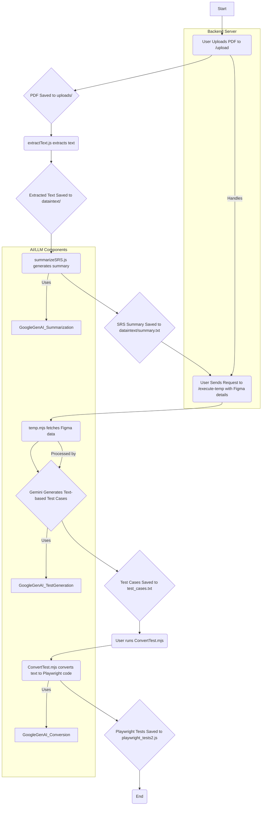

        *   **LLM-based Test Case Generation:** The extracted Figma data and the SRS summary are now directly passed to Google Generative AI (`gemini-2.5-flash`). This AI model intelligently crafts comprehensive, text-based Playwright test cases, which are then saved to `test_cases.txt`. This step replaces the previous dependency on a local LLM, making the pipeline more streamlined and cloud-native.
        *   **Playwright Test File Conversion:** `ConvertTest.mjs` reads the generated `test_cases.txt` and uses Google Generative AI to translate these structured text cases into executable Playwright JavaScript test files (e.g., `playwright_tests2.js`), complete with assertions and page interactions.

The `server.mjs` orchestrates these scripts, allowing the frontend to trigger the entire pipeline through simple API calls.

---

# Chapter 4: Major Functionality

The project provides the following key functionalities:

1.  **PDF Document Upload:**
    *   Allows users to upload SRS documents in PDF format to the backend.
    *   Stores uploaded PDFs in a designated `uploads/` directory.

2.  **Text Extraction from PDFs:**
    *   Automatically extracts all textual content from the uploaded PDF documents.
    *   Saves the extracted text into a `.txt` file for further processing.

3.  **SRS Summarization using Google Generative AI:**
    *   Processes the extracted SRS text through the Google Generative AI model (`gemini-2.5-flash`).
    *   Generates a concise summary highlighting functional and non-functional requirements.
    *   Stores the summary in a dedicated `summary.txt` file.

4.  **Figma Design Data Extraction:**
    *   Connects to the Figma API using provided authentication tokens and project URLs.
    *   Navigates through Figma project pages and frames.
    *   Extracts critical UI element information (e.g., button names, input field types, text labels) from the designs.

5.  **AI-Powered Test Case Generation (using Google Generative AI):**
    *   Combines the summarized SRS requirements with the extracted Figma UI data.
    *   Feeds this comprehensive context directly to Google Generative AI (`gemini-2.5-flash`).
    *   Generates detailed, step-by-step Playwright test cases in a human-readable text format, saved as `test_cases.txt`. These cases include positive and negative scenarios, expected results, and UI element interactions.

6.  **Automated Playwright Test File Creation:**
    *   Converts the text-based test cases from `test_cases.txt` into fully functional Playwright JavaScript test files.
    *   Utilizes Google Generative AI (`gemini-2.5-flash`) to understand the structured text and generate executable Playwright code with appropriate assertions and actions.
    *   Outputs the final Playwright test scripts to a designated `.js` file (e.g., `playwright_tests2.js`), ready to be run by the Playwright test runner.

---

# Chapter 5: Flow Chart (Graphical representation of your project)

*(Please insert your project's flow chart here. A typical flow would be:)*

---

# Chapter 6: Screenshots of your project output

*(Please insert screenshots of your project's output here. This could include:)*

*   **Screenshot 1:** A successful PDF upload confirmation message from the backend.
*   **Screenshot 2:** The contents of `dataintext/extracted_text.txt` showing raw text from an SRS.
*   **Screenshot 3:** The contents of `dataintext/summary.txt` showing the AI-generated SRS summary.
*   **Screenshot 4:** Console output from `temp.mjs` showing successful Figma data extraction.
*   **Screenshot 5:** The contents of `test_cases.txt` displaying the Gemini-generated, human-readable test cases.
*   **Screenshot 6:** The final `playwright_tests2.js` file, containing the executable Playwright test code.
*   **Screenshot 7:** A terminal screenshot showing Playwright tests being run and their results.

---

# Chapter 7: Limitations of project

While this project offers significant advancements in test automation, it has certain limitations:

*   **LLM Accuracy and Hallucination:** The quality and accuracy of generated summaries and test cases are heavily dependent on the underlying LLM's capabilities. LLMs can occasionally "hallucinate" information, generating plausible but incorrect details.
*   **Local LLM Dependency:** Relying on a local LLM requires specific hardware (especially for GPU acceleration) and configuration, which can be a barrier for deployment or users without such resources. **Note: The project now primarily uses Google Generative AI for test case generation, reducing the direct reliance on a local LLM for this step.**
*   **Maintainability of Generated Tests:** While tests are generated, maintaining them (e.g., when UI changes) still requires human review, although the initial generation is automated. The project doesn't include an automated mechanism for re-generating or updating tests based on minor design tweaks.
*   **Complex UI Interactions:** Generating tests for highly dynamic, interactive, or complex UI components (e.g., drag-and-drop, rich text editors, dynamic graphs) might require more sophisticated prompt engineering or manual intervention.
*   **Figma API Scope:** The current Figma integration extracts specific UI element types. Complex design patterns or custom components might not be fully captured, limiting the detail in generated tests.
*   **Error Propagation:** Error handling within the system could be more robust, ensuring that failures in one script are gracefully handled and communicated throughout the pipeline.
*   **Scalability for Large Documents/Designs:** Processing extremely large PDF documents or very complex Figma designs might lead to performance bottlenecks or increased LLM token usage/costs.

---
